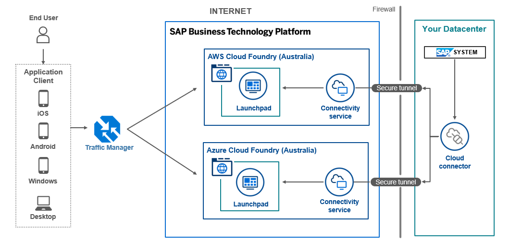
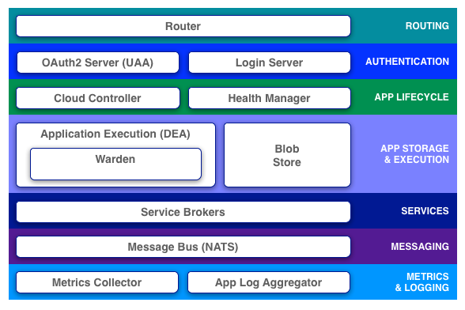
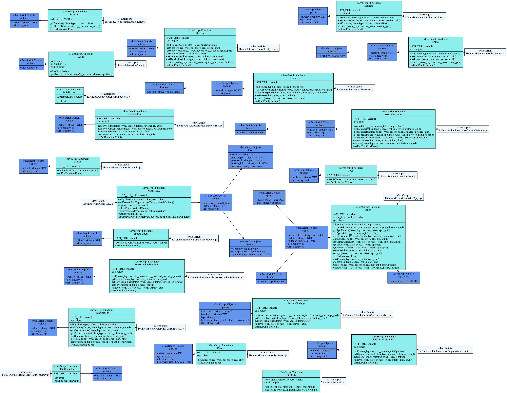

# cf-node-client

[](https://www.npmjs.com/package/cf-node-client)
[](https://www.npmjs.com/package/cf-node-client)
[](LICENSE)

A **Node.js client library** for the [Cloud Foundry](https://www.cloudfoundry.org/) API (v2 & v3), with built-in TypeScript support.

> **Maintained by** [leotrinh](https://github.com/leotrinh) — forked from [prosociallearnEU/cf-nodejs-client](https://github.com/prosociallearnEU/cf-nodejs-client) by Juan Antonio Breña Moral.

## Ship by Claude Kit

Ship faster with AI Dev Team — [DISCOUNT 25% - PAY ONE TIME, LIFETIME UPGRADE](https://claudekit.cc/?ref=VAK416FU)


---

## Supported Cloud Foundry Platforms

This library works with any platform that implements the Cloud Foundry API:

| Platform | Provider | Status |
|----------|----------|--------|
| [SAP BTP Cloud Foundry](https://help.sap.com/docs/btp/sap-business-technology-platform/cloud-foundry-environment) | SAP | ✅ Supported |
| [Tanzu Platform (formerly Pivotal / TAS)](https://tanzu.vmware.com/platform) | Broadcom / VMware | ✅ Supported |
| [IBM Cloud Foundry](https://www.ibm.com/cloud/cloud-foundry) | IBM | ✅ Supported |
| [SUSE Cloud Application Platform](https://www.suse.com/products/cloud-application-platform/) | SUSE | ✅ Supported |
| [Open Source Cloud Foundry](https://www.cloudfoundry.org/) | Cloud Foundry Foundation | ✅ Supported |
| Any CF-compatible API endpoint | — | ✅ Supported |

### Architecture Overview

**SAP BTP Cloud Foundry**


**Cloud Foundry Architecture**



**UML Diagram**


---

## Documentation

| Document | Description |
|----------|-------------|
| [**JSDoc API Reference**](https://leotrinh.github.io/cf-node-client/doc/) | Full generated API documentation (all classes, methods, params) |
| [Usage Guide](docs/Usage.md) | Configuration & API usage examples |
| [Service Usage](docs/Usage-cf-service.md) | CF Service integration guide |
| [System Architecture](docs/SystemArchitecture.md) | Internal architecture overview |

### Documentation Detail

The JSDoc API Reference covers every public class and method in the library:

| Class | Description | JSDoc |
|-------|-------------|-------|
| `CloudController` | CF API info & version | [View](https://leotrinh.github.io/cf-node-client/doc/CloudController.html) |
| `Apps` | Application lifecycle (CRUD, start, stop, env, routes) | [View](https://leotrinh.github.io/cf-node-client/doc/Apps.html) |
| `Organizations` | Org management, quotas, domains, users | [View](https://leotrinh.github.io/cf-node-client/doc/Organizations.html) |
| `Spaces` | Space management, apps, services per space | [View](https://leotrinh.github.io/cf-node-client/doc/Spaces.html) |
| `Services` | Service offerings & plans | [View](https://leotrinh.github.io/cf-node-client/doc/Services.html) |
| `ServiceInstances` | Service instance CRUD & bindings | [View](https://leotrinh.github.io/cf-node-client/doc/ServiceInstances.html) |
| `ServiceBindings` | Service binding management | [View](https://leotrinh.github.io/cf-node-client/doc/ServiceBindings.html) |
| `ServicePlans` | Service plan listing & management | [View](https://leotrinh.github.io/cf-node-client/doc/ServicePlans.html) |
| `UserProvidedServices` | User-provided service instances | [View](https://leotrinh.github.io/cf-node-client/doc/UserProvidedServices.html) |
| `Routes` | Route management & mappings | [View](https://leotrinh.github.io/cf-node-client/doc/Routes.html) |
| `Domains` | Domain management | [View](https://leotrinh.github.io/cf-node-client/doc/Domains.html) |
| `BuildPacks` | Buildpack management | [View](https://leotrinh.github.io/cf-node-client/doc/BuildPacks.html) |
| `Stacks` | Stack listing | [View](https://leotrinh.github.io/cf-node-client/doc/Stacks.html) |
| `Users` | User management | [View](https://leotrinh.github.io/cf-node-client/doc/Users.html) |
| `Events` | Audit events | [View](https://leotrinh.github.io/cf-node-client/doc/Events.html) |
| `Jobs` | Background tasks | [View](https://leotrinh.github.io/cf-node-client/doc/Jobs.html) |
| `OrganizationsQuota` | Org quota definitions | [View](https://leotrinh.github.io/cf-node-client/doc/OrganizationsQuota.html) |
| `SpacesQuota` | Space quota definitions | [View](https://leotrinh.github.io/cf-node-client/doc/SpacesQuota.html) |
| `UsersUAA` | UAA authentication (login, tokens) | [View](https://leotrinh.github.io/cf-node-client/doc/UsersUAA.html) |
| `Logs` | Application log streaming | [View](https://leotrinh.github.io/cf-node-client/doc/Logs.html) |
| `HttpUtils` | HTTP request utilities | [View](https://leotrinh.github.io/cf-node-client/doc/HttpUtils.html) |

#### Generate Docs Locally

```bash
# Generate JSDoc HTML into doc/ folder
npm run docs

# Generate + serve on localhost:9000 + open browser
npm run docs:serve
```

---

## Installation

```bash
npm install cf-node-client
```

---

## Quick Start

### JavaScript

```javascript
const { CloudController, UsersUAA, Apps } = require("cf-node-client");

const uaa = new UsersUAA("https://login.<your-cf-domain>");
const token = await uaa.login("user", "pass");

const apps = new Apps("https://api.<your-cf-domain>");
apps.setToken(token);
const result = await apps.getApps();
console.log(result.resources);
```

### TypeScript

```typescript
import {
  CloudController,
  UsersUAA,
  Apps,
  Spaces,
  Organizations,
  OAuthToken
} from "cf-node-client";

const uaa = new UsersUAA("https://login.<your-cf-domain>");
const token: OAuthToken = await uaa.login("user", "pass");

const apps = new Apps("https://api.<your-cf-domain>");
apps.setToken(token);
const result = await apps.getApps();
console.log(result.resources);
```

Built-in TypeScript declarations are included — no additional `@types` package needed.

### Available Types

| Type | Description |
|------|-------------|
| `OAuthToken` | UAA authentication token |
| `FilterOptions` | Pagination and query filters |
| `DeleteOptions` | Delete operation options |
| `ApiResponse<T>` | Typed API response wrapper |
| `CloudControllerBaseOptions` | Base constructor options |

See [examples/](examples/) for more usage patterns.

---

## Convenience Methods

Find resources by name using **server-side filtering** — a single API call instead of fetching all resources and looping:

```javascript
const { Organizations, Spaces, Apps, ServiceInstances } = require("cf-node-client");

const orgs = new Organizations("https://api.<your-cf-domain>");
const spaces = new Spaces("https://api.<your-cf-domain>");
const apps = new Apps("https://api.<your-cf-domain>");
const si = new ServiceInstances("https://api.<your-cf-domain>");

orgs.setToken(token); spaces.setToken(token);
apps.setToken(token); si.setToken(token);

// Find by name (returns first match or null)
const org   = await orgs.getOrganizationByName("my-org");
const space = await spaces.getSpaceByName("dev", orgGuid);       // orgGuid optional
const app   = await apps.getAppByName("my-app", spaceGuid);      // spaceGuid optional
const inst  = await si.getInstanceByName("my-db", spaceGuid);    // spaceGuid optional

// Get by GUID (direct lookup)
const org   = await orgs.getOrganization(orgGuid);
const space = await spaces.getSpace(spaceGuid);
const app   = await apps.getApp(appGuid);
const inst  = await si.getInstance(instanceGuid);
```

| Resource         | List All              | Get by GUID              | Find by Name                              | Get ALL (paginated)           |
| ---------------- | --------------------- | ------------------------ | ----------------------------------------- | ----------------------------- |
| Organizations    | `getOrganizations()`  | `getOrganization(guid)`  | `getOrganizationByName(name)`             | `getAllOrganizations(filter?)` |
| Spaces           | `getSpaces()`         | `getSpace(guid)`         | `getSpaceByName(name, orgGuid?)`          | `getAllSpaces(filter?)`       |
| Apps             | `getApps()`           | `getApp(guid)`           | `getAppByName(name, spaceGuid?)`          | `getAllApps(filter?)`         |
| ServiceInstances | `getInstances()`      | `getInstance(guid)`      | `getInstanceByName(name, spaceGuid?)`     | `getAllInstances(filter?)`    |

> Works with both v2 (`q=name:X`) and v3 (`names=X`) APIs automatically.

---

## Auto-Pagination

No more manual pagination loops — the library pages through every page and returns a flat array:

```javascript
const allOrgs   = await orgs.getAllOrganizations();
const allSpaces = await spaces.getAllSpaces();
const allApps   = await apps.getAllApps({ q: "space_guid:xxx" });
const allSIs    = await si.getAllInstances();
```

Handles both v2 (`next_url`) and v3 (`pagination.next`) transparently. v3 fetches 200 per page; v2 fetches 100 per page.

---

## Memory Cache

Opt-in, in-memory cache with configurable TTL (default 30 s). Reduces redundant API calls when the same data is requested multiple times:

```javascript
// Enable at construction time
const orgs = new Organizations(api, { cache: true, cacheTTL: 60000 });
orgs.setToken(token);

await orgs.getAllOrganizations();   // API call → result cached
await orgs.getAllOrganizations();   // cache hit — 0 HTTP calls

// Toggle at runtime
orgs.enableCache();          // default 30 s TTL
orgs.enableCache(60000);     // custom 60 s TTL
orgs.clearCache();           // clear entries, keep cache enabled
orgs.disableCache();         // turn off + clear all
```

---

## API Reference

### v3 Endpoints (Default)

All API calls use **v3** by default. No additional configuration needed.

| Resource | Docs |
|----------|------|
| Apps | [API](https://v3-apidocs.cloudfoundry.org/index.html#list-apps) |
| Spaces | [API](https://v3-apidocs.cloudfoundry.org/#list-spaces) |
| Service Instances | [API](https://v3-apidocs.cloudfoundry.org/#list-service-instances) |
| Service Bindings | [API](https://v3-apidocs.cloudfoundry.org/#list-service-bindings) |
| Organizations | [API](https://v3-apidocs.cloudfoundry.org/#list-organizations) |
| Users | [API](https://v3-apidocs.cloudfoundry.org/#list-users) |
| Other v3 endpoints | [Full v3 API Reference](https://v3-apidocs.cloudfoundry.org/) |

### v2 Endpoints (Legacy)

> **Note:** CF API v2 is deprecated by Cloud Foundry. Use v2 only if your platform has not yet migrated to v3.

To enable v2, pass `{ apiVersion: "v2" }` when creating any resource instance:

```javascript
const { Apps, Spaces, Organizations } = require("cf-node-client");

// v2 mode
const apps = new Apps("https://api.<your-cf-domain>", { apiVersion: "v2" });
const spaces = new Spaces("https://api.<your-cf-domain>", { apiVersion: "v2" });
const orgs = new Organizations("https://api.<your-cf-domain>", { apiVersion: "v2" });
```

| Resource | Docs |
|----------|------|
| Apps | [API](https://prosociallearneu.github.io/cf-nodejs-client/docs/v0.12.0/Apps.html) |
| Buildpacks | [API](https://prosociallearneu.github.io/cf-nodejs-client/docs/v0.12.0/BuildPacks.html) |
| Domains | [API](https://prosociallearneu.github.io/cf-nodejs-client/docs/v0.12.0/Domains.html) |
| Jobs | [API](https://prosociallearneu.github.io/cf-nodejs-client/docs/v0.12.0/Jobs.html) |
| Organizations | [API](https://prosociallearneu.github.io/cf-nodejs-client/docs/v0.12.0/Organizations.html) |
| Organizations Quotas | [API](https://prosociallearneu.github.io/cf-nodejs-client/docs/v0.12.0/OrganizationsQuota.html) |
| Routes | [API](https://prosociallearneu.github.io/cf-nodejs-client/docs/v0.12.0/Routes.html) |
| Services | [API](https://prosociallearneu.github.io/cf-nodejs-client/docs/v0.12.0/Services.html) |
| Service Bindings | [API](https://prosociallearneu.github.io/cf-nodejs-client/docs/v0.12.0/ServiceBindings.html) |
| Service Instances | [API](https://prosociallearneu.github.io/cf-nodejs-client/docs/v0.12.0/ServiceInstances.html) |
| Service Plans | [API](https://prosociallearneu.github.io/cf-nodejs-client/docs/v0.12.0/ServicePlans.html) |
| Spaces | [API](https://prosociallearneu.github.io/cf-nodejs-client/docs/v0.12.0/Spaces.html) |
| Spaces Quotas | [API](https://prosociallearneu.github.io/cf-nodejs-client/docs/v0.12.0/SpacesQuota.html) |
| Stacks | [API](https://prosociallearneu.github.io/cf-nodejs-client/docs/v0.12.0/Stacks.html) |
| User Provided Services | [API](https://prosociallearneu.github.io/cf-nodejs-client/docs/v0.12.0/UserProvidedServices.html) |
| Users | [API](https://prosociallearneu.github.io/cf-nodejs-client/docs/v0.12.0/Users.html) |

---

## Testing

```bash
# Run test suite
npm test

# Run unit tests only
npm run test:unit

# Code coverage
istanbul cover node_modules/mocha/bin/_mocha -- -R spec
```

---

## Changelog

See [CHANGELOG.md](CHANGELOG.md) for version history.

---

## References

- [Cloud Foundry API Docs](https://apidocs.cloudfoundry.org/)
- [Cloud Foundry v3 API Docs](https://v3-apidocs.cloudfoundry.org/)
- [CF Developer Mailing List](https://lists.cloudfoundry.org/archives/list/cf-dev@lists.cloudfoundry.org/)
- [SAP BTP Cloud Foundry Docs](https://help.sap.com/docs/btp/sap-business-technology-platform/cloud-foundry-environment)

---

## Contributing

Contributions are welcome! We want to make contributing as easy and transparent as possible.

**How to contribute:**

1. Fork the repository
2. Create your feature branch (`git checkout -b feature/my-feature`)
3. Write or improve **tests** — this is the most impactful way to help
4. Ensure all tests pass (`npm test`)
5. Commit your changes (`git commit -m 'feat: add some feature'`)
6. Push to the branch (`git push origin feature/my-feature`)
7. Open a **Pull Request**

> **First time?** Look for issues labeled `good first issue` — writing tests is a great way to start. Every PR with new test coverage is highly appreciated!

---

## Upstream Issues Tracker

This fork tracks and resolves issues from the original upstream repositories:
- [prosociallearnEU/cf-nodejs-client/issues](https://github.com/prosociallearnEU/cf-nodejs-client/issues)
- [IBM-Cloud/cf-nodejs-client/issues](https://github.com/IBM-Cloud/cf-nodejs-client/issues)

Individual issue docs: [docs/issues/](docs/issues/)

### ✅ Resolved in This Fork

| # | Origin | Issue | Doc |
|---|--------|-------|-----|
| #191 | prosociallearnEU | Set environment variables (`cf set-env` equivalent) | [Details](docs/issues/prosocial-191-set-env-variables.md) |
| #190 | prosociallearnEU | Works with any CF environment + space handling | [Details](docs/issues/prosocial-190-any-cf-env-support.md) |
| #188 | prosociallearnEU | Travis CI build broken → migrated to GitHub Actions | [Details](docs/issues/prosocial-188-travis-build-broken.md) |
| #179 | prosociallearnEU | How to create a CF app (documented) | [Details](docs/issues/prosocial-179-create-cf-app.md) |
| #43 | IBM-Cloud | Any CF env support (documented) | [Details](docs/issues/ibm-043-any-cf-env-support.md) |

### 🔧 Open / In Progress

| # | Origin | Issue | Priority | Doc |
|---|--------|-------|----------|-----|
| #198 | prosociallearnEU | `Apps.upload()` broken on Node 12+ (restler) | Critical | [Details](docs/issues/prosocial-198-apps-upload-restler-bug.md) |
| #50 | IBM-Cloud | Node security alerts (multiple deps) | Critical | [Details](docs/issues/ibm-050-node-security-alerts.md) |
| #52 | IBM-Cloud | protobufjs vulnerability | High | [Details](docs/issues/ibm-052-protobufjs-vulnerability.md) |
| #192 | prosociallearnEU | Async service creation (`accepts_incomplete`) | High | [Details](docs/issues/prosocial-192-async-service-creation.md) |
| #45 | IBM-Cloud | Events/Logs TypeError at runtime | High | [Details](docs/issues/ibm-045-events-logs-type-error.md) |
| #199 | prosociallearnEU | HANA Cloud DB start/stop control | Medium | [Details](docs/issues/prosocial-199-hana-cloud-start-stop.md) |
| #156 | prosociallearnEU | URL validation in constructors | Medium | [Details](docs/issues/prosocial-156-url-validation.md) |
| #44 | IBM-Cloud | APIKey auth (instead of user/password) | Medium | [Details](docs/issues/ibm-044-apikey-auth.md) |
| #47 | IBM-Cloud | Same-name services in different spaces | Medium | [Details](docs/issues/ibm-047-missing-service-instances.md) |
| #15 | IBM-Cloud | `getTokenInfo(accessToken)` method | Medium | [Details](docs/issues/ibm-015-get-token-info.md) |
| #183 | prosociallearnEU | Log timestamp missing | Medium | [Details](docs/issues/prosocial-183-log-timestamp-missing.md) |
| #196 | prosociallearnEU | Copy bits between apps | Low | [Details](docs/issues/prosocial-196-copy-bits-between-apps.md) |
| #173 | prosociallearnEU | Respect `.cfignore` on upload | Low | [Details](docs/issues/prosocial-173-cfignore-support.md) |
| #161 | prosociallearnEU | Improve JSDocs / TypeScript types | Low | [Details](docs/issues/prosocial-161-improve-jsdocs.md) |
| #158 | prosociallearnEU | Download droplet from app | Low | [Details](docs/issues/prosocial-158-download-droplet.md) |
| #157 | prosociallearnEU | Download bits from app | Low | [Details](docs/issues/prosocial-157-download-bits.md) |

---

## Issues

If you have any questions or find a bug, please [create an issue](https://github.com/leotrinh/cf-node-client/issues).

## License

Licensed under the [Apache License, Version 2.0](http://www.apache.org/licenses/LICENSE-2.0).
