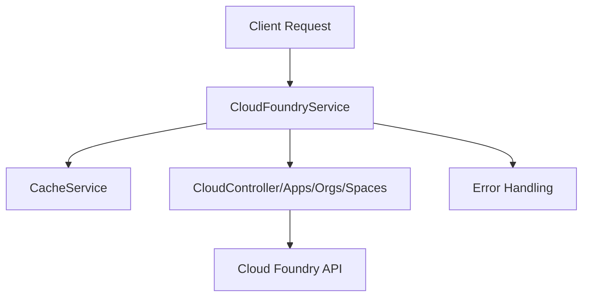

# System Architecture

## Overview
This document describes the system design, code patterns, and project structure of the Cloud Foundry Node.js client codebase.

## Project Structure
```
cf-nodejs-client/
├── docs/
│   ├── SystemArchitecture.md
│   ├── Usage.md
│   └── ...
├── lib/
│   └── model/
│       ├── cloudcontroller/
│       ├── metrics/
│       └── uaa/
├── test/
├── index.js
├── package.json
└── ...
```

## Main Components
- **lib/model/cloudcontroller/**: Cloud Foundry API v2/v3 models (Apps, Organizations, Spaces, etc.)
- **lib/model/metrics/**: Metrics models
- **lib/model/uaa/**: User authentication and authorization models
- **lib/utils/**: Utility functions (HTTP, status codes, etc.)
- **test/**: Mocha/Chai test suites
- **docs/**: Documentation and planning

## Code Patterns
- **SOLID Principles**: Separation of concerns, single responsibility for each model/service
- **DRY**: Shared logic extracted to utils/services
- **KISS/YAGNI**: Simple, maintainable code, minimal overengineering
- **Service Layer**: Example: `CloudFoundryService` encapsulates API orchestration, caching, error handling

## Flow Diagram (MermaidJS)


## Extensibility
- Add new API models in `lib/model/cloudcontroller/`
- Extend service logic in `ref/cf.service.js`
- Add tests in `test/`

## Best Practices
- Use async/await for API calls
- Centralize error handling
- Cache expensive API results
- Modularize code for maintainability

---
For more details, see [Usage.md](docs/Usage.md) and code samples below.
